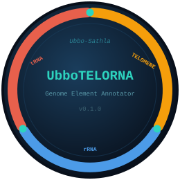

<p align="center">

</p>

<p align="center">


<a href="CHANGELOG.md"></a>
</p>

---

## UbboTELORNA

**UbboTELORNA** annotates three classes of ancient, conserved genomic elements
in genome assemblies: telomeres, ribosomal RNA (rRNA) genes, and transfer RNA
(tRNA) genes — with built-in low-complexity masking that prevents tool failures
on telomeric and repetitive sequences.

The name blends **Ubbo-Sathla** (Clark Ashton Smith, 1933) — the primordial
protoplasmic source of all terrestrial life in the Lovecraft Mythos — with
**TELO**mere and **RNA**.  Just as Ubbo-Sathla is the origin from which all
biological complexity descends, telomeres, rDNA, and tRNA represent the most
ancient, conserved elements of the eukaryotic genome.

### Why not barrnap?

`barrnap` (internally `nhmmer`) fails when a sequence starts with a
low-complexity pattern such as a telomeric repeat (`ACACAC…`, `TTTAGGG…`).
UbboTELORNA solves this by:

1. **Identifying telomeres first** (Module 0) — pure-Python k-mer scan, no external dependencies.
2. **Masking low-complexity regions** (Module 2) — `tantan` soft-mask before any search tool runs.
3. **Flexible rRNA search** (Module 3) — `nhmmer` (default, fast, low memory) or Infernal
   `cmsearch` (higher sensitivity) via `--search_tool`.

See [docs/about_rrna_identification.md](docs/about_rrna_identification.md) for a detailed
comparison of nhmmer vs cmsearch: speed, memory, sensitivity, and when to use each.

See [docs/benchmarking.md](docs/benchmarking.md) for the full benchmark plan:
tools compared, genome set (13 genomes across prokaryotes, fungi, invertebrates,
plants, and vertebrates), metrics, and robustness tests.

See [docs/green_computing_benchmarking.md](docs/green_computing_benchmarking.md)
for a focused, fast (5-genome) companion benchmark measuring real energy/CO2eq
emissions via `codecarbon`, not just wall-clock time.

---

## Overview

| Module | Step | Tool | Output |
|---|---|---|---|
| 0 | Telomere identification | Custom k-mer scan | `mod00_telomeres_{prefix}.gff3` |
| 1 | Subtelomeric tandem repeats | TRF | `mod01_subtelomeric_{prefix}.gff3`, `mod01_completeness_{prefix}.tsv` |
| 2 | Low-complexity masking | tantan | `workdir/masked_soft.fasta`, `workdir/masked_hard.fasta` |
| 3 | rRNA annotation | nhmmer (default) or cmsearch + Rfam profiles | `mod03_rRNA_{prefix}.gff3` |
| 4 | tRNA annotation | ARAGORN | `mod04_tRNA_{prefix}.gff3` |
| 5 | Integration | — | `mod05_annotation_{prefix}.gff3`, `mod05_summary_{prefix}.tsv` |
| 6 | Visualization | matplotlib | `mod06_plot_{prefix}.{pdf\|png\|svg}` |
| 7 | Evolutionary analysis | cmsearch RF00005 + custom Python | `mod07_rrna_scores_{prefix}.tsv`, `mod07_trna_class_{prefix}.tsv`, `mod07_arrays_{prefix}.tsv`, `mod07_evolution_{prefix}.{pdf\|png\|svg}` |

### Rfam models used

| Kingdom | Model name | Rfam accession | Target |
|---|---|---|---|
| `euka` | 5S_rRNA | RF00001 | 5S ribosomal RNA |
| `euka` | 5_8S_rRNA | RF00002 | 5.8S ribosomal RNA |
| `euka` | SSU_rRNA_eukarya | RF01960 | 18S small subunit rRNA |
| `euka` | LSU_rRNA_eukarya | RF02543 | 28S large subunit rRNA |
| `bacteria` | 5S_rRNA | RF00001 | 5S rRNA |
| `bacteria` | SSU_rRNA_bacteria | RF00177 | 16S rRNA |
| `bacteria` | LSU_rRNA_bacteria | RF02541 | 23S rRNA |
| `archaea` | 5S_rRNA | RF00001 | 5S rRNA |
| `archaea` | SSU_rRNA_archaea | RF01959 | 16S archaeal rRNA |
| `archaea` | LSU_rRNA_archaea | RF02540 | 23S archaeal rRNA |

On first use, models are fetched automatically from `https://rfam.org/`:

- **nhmmer** — downloads the Rfam seed alignment (Stockholm) for each
  family and builds a HMMER3 `.hmm` profile with `hmmbuild --rna`.
- **cmsearch** — downloads the Rfam `.cm` covariance model directly.

All files are cached in `~/.ubbotelorna/rfam/`.  On **air-gapped HPC
nodes**, build or download the files once on a machine with internet
access and supply the directory with `--rfam_dir /path/to/rfam/`.

---

## Requirements

```bash
conda env create -f envs/UbboTELORNA.yaml
conda activate ubbotelorna
```

| Dependency | Role | Install |
|---|---|---|
| Python ≥ 3.10 | Runtime | included in conda env |
| `tantan` | Low-complexity masking (Module 2) | `conda install -c bioconda tantan` |
| `hmmer` (`nhmmer`) | rRNA annotation — default (Module 3) | `conda install -c bioconda hmmer` |
| `infernal` (`cmsearch`) | rRNA annotation — alternative (Module 3) | `conda install -c bioconda infernal` |
| `aragorn` | tRNA annotation (Module 4) | `conda install -c bioconda aragorn` |
| `matplotlib` | Visualization (Module 6) | `conda install -c conda-forge matplotlib` |
| `codecarbon` | Carbon footprint tracking (optional) | `conda install -c conda-forge codecarbon` |

---

## Quick start

```bash
python3 scripts/UbboTELORNA.py \
    --fasta  genome.fasta \
    --output annotation_run/
```

---

## Usage

```
UbboTELORNA.py --fasta FASTA --output DIR [options]
```

---

## Options

### Required

| Flag | Description |
|---|---|
| `--fasta` | Input genome assembly FASTA |
| `--output` | Output directory (created if absent) |

### Module 0 — Telomere identification

| Flag | Default | Description |
|---|---|---|
| `--telomere_repeat` | auto-detect | Known repeat unit (e.g. `TTTAGGG` plants, `TTAGGG` vertebrates) |
| `--telomere_window` | 10000 | bp to scan at each contig end |
| `--telomere_density` | 0.5 | Minimum repeat density (0–1) to call a telomere |
| `--telomere_min_len` | 100 | Minimum telomere length to report (bp) |

### Module 3 — rRNA annotation

| Flag | Default | Description |
|---|---|---|
| `--kingdom` | `euka` | Organism kingdom: `euka`, `bacteria`, or `archaea` |
| `--evalue` | 1e-5 | E-value threshold for rRNA search |
| `--rfam_dir` | `~/.ubbotelorna/rfam/` | Directory with pre-downloaded Rfam `.hmm`/`.cm` files |
| `--search_tool` | `nhmmer` | rRNA search tool: `nhmmer` (fast, low memory) or `cmsearch` (higher sensitivity) |
| `--cmsearch_mxsize` | 512 | Max DP matrix per cmsearch thread (Mb) — only used with `--search_tool cmsearch` |

See [docs/about_rrna_identification.md](docs/about_rrna_identification.md) for a full
comparison of the two tools.

### General

| Flag | Default | Description |
|---|---|---|
| `--threads` | 4 | CPU threads for the rRNA search tool |
| `--skip_module` | — | Comma-separated module numbers to skip: `0`=telomere `1`=subtelomeric tandem repeats `2`=masking `3`=rRNA `4`=tRNA `5`=integration `6`=visualization `7`=evolution (e.g. `--skip_module 0,1,2`) |
| `--format` | `pdf` | Plot format(s): `pdf`, `png`, `svg` — comma-separated |
| `--top_sequences` | `50` | Number of sequences shown in the ideogram |
| `--sort_sequences` | `length` | Ideogram sequence order: `length` (longest first) or `seqid` (natural Chr1/Chr2/… sort) |
| `--force` | — | Rerun all steps even if outputs already exist |
| `--dry_run` | — | Validate inputs, print steps, exit |
| `--disable_co2_tracking` | — | Disable codecarbon carbon tracking |
| `--version` | — | Print version and exit |

---

## Output directory layout

```
{output}/
├── results/
│   ├── mod00_telomeres_{prefix}.gff3       Telomere features (Module 0)
│   ├── mod01_subtelomeric_{prefix}.gff3    Subtelomeric tandem repeats (Module 1)
│   ├── mod01_completeness_{prefix}.tsv     Telomere-completeness tiering (Module 1)
│   ├── mod03_rRNA_{prefix}.gff3            rRNA features (Module 3)
│   ├── mod04_tRNA_{prefix}.gff3            tRNA features (Module 4)
│   ├── mod05_annotation_{prefix}.gff3      Combined GFF3 (Module 5)
│   ├── mod05_summary_{prefix}.tsv          Detailed feature summary (count, length, % genome)
│   ├── mod06_plot_{prefix}.pdf             Visualization figure (Module 6; format set by --format)
│   ├── mod07_rrna_scores_{prefix}.tsv      Per-copy rRNA bit scores (Module 7a)
│   ├── mod07_trna_class_{prefix}.tsv       tRNA functional/pseudogene classification (Module 7b)
│   ├── mod07_arrays_{prefix}.tsv           Tandem array table with spacing stats (Module 7c)
│   ├── mod07_evolution_{prefix}.pdf        Evolutionary analysis figure (Module 7d)
│   └── {prefix}.run_summary.json           Run metadata and resource usage
├── workdir/
│   ├── masked_soft.fasta                   Soft-masked FASTA (tantan lowercase)
│   ├── masked_hard.fasta                   Hard-masked FASTA (N's, used by search tools)
│   ├── nhmmer_rRNA.tblout                  Raw nhmmer tabular output (or cmsearch_rRNA.tblout)
│   └── aragorn.txt                         Raw ARAGORN output
└── logs/
    ├── Run_UbboTELORNA.log                 Full timestamped run log
    └── {prefix}.emissions.csv              Carbon footprint (codecarbon)
```

### GFF3 attribute fields

**Telomere features:**
```
ID=tel_{seq}_{end}_{n};Name=telomere_{5prime|3prime};repeat_unit=TTTAGGG;density=0.923
```

**rRNA features:**
```
ID=rRNA_{n};Name=5S_rRNA;model=RF00001;score=142.3;E-value=1.2e-42
```

**tRNA features:**
```
ID=tRNA_{n};Name=tRNA-Phe(GAA);anticodon=GAA
```

### Summary TSV

`results/mod05_summary_{prefix}.tsv` contains one row per subtype plus a
`TOTAL` row for each feature class.  All GFF3 outputs are sorted by SeqID
(natural order, so `Chr2 < Chr10`) then by start coordinate.

```
feature_type    subtype              count    total_length_bp    pct_genome
telomere        TOTAL                71       710000             0.1014
telomere        3prime               36       360000             0.0514
telomere        5prime               35       350000             0.0500
rRNA            TOTAL                21871    43742000           6.2489
rRNA            5S_rRNA              10233    1238193            0.1769
rRNA            5_8S_rRNA            3372     539520             0.0771
rRNA            SSU_rRNA_eukarya     3177     5890476            0.8415
rRNA            LSU_rRNA_eukarya     3279     36074311           5.1534
tRNA            TOTAL                3546     265950             0.0380
tRNA            tRNA-Ala             312      23400              0.0033
tRNA            tRNA-Gly             289      21675              0.0031
...
```

- `total_length_bp` — sum of (end − start + 1) for all features of that subtype
- `pct_genome` — `total_length_bp / genome_size × 100` (4 decimal places; `NA` if genome size unavailable)
- rRNA subtypes are written in biological order (5S → 5.8S → SSU → LSU)
- tRNA subtypes are sorted by count descending, then alphabetically

---

## Visualization (Module 6)

`results/mod06_plot_{prefix}.pdf` is a three-panel figure generated
automatically at the end of every run (unless `--skip_module 6` is set).

```
┌──────────────────────────────────────────────────────────────────┐
│  Genome ideogram (top N sequences by length)                     │
│  grey bar = sequence; amber = telomere; blue = rRNA; red = tRNA  │
├────────────────────────┬───────────────────────┬─────────────────┤
│  rRNA subtypes         │  tRNA types (top 20)  │  Genome donut   │
│  horizontal bar chart  │  horizontal bar chart  │  composition    │
│  (biological order)    │  (count descending)    │  (% by class)   │
└────────────────────────┴───────────────────────┴─────────────────┘
```

**Panel 1 — Genome ideogram**

Each sequence is drawn as a horizontal bar.  Features are overlaid using
`broken_barh` with alpha blending: rRNA clusters appear as denser blue
bands; individual tRNA loci show as red ticks; telomeres are fully opaque
amber marks at sequence ends.  Sequences are sorted by length (longest at
top) and limited to `--top_sequences` (default 50).

**Panel 2 — rRNA subtype bars**

Horizontal bar chart showing count per rRNA subtype in biological order:
5S → 5.8S → SSU → LSU.  Count labels are printed at the end of each bar.

**Panel 3 — tRNA type bars**

Horizontal bar chart showing count per tRNA type, sorted by count
descending (up to 20 types shown).

**Panel 4 — Genome composition donut**

A ring chart showing the fraction of the genome covered by telomere, rRNA,
and tRNA sequences.  The remaining fraction is labelled "Other".  Genome
size in Mb is printed in the donut hole.  Percentages are derived from the
`total_length_bp` column of the summary TSV.

**Format, sequence count, and ordering**

```bash
# Save as PNG and SVG instead of PDF
python3 scripts/UbboTELORNA.py --fasta genome.fasta --output run/ \
    --skip_module0 --skip_module2 --skip_module3 --skip_module4 \
    --skip_integration \
    --format png,svg

# Sort sequences by chromosome name (Chr1, Chr2 … Chr20) rather than size
python3 scripts/UbboTELORNA.py --fasta genome.fasta --output run/ \
    --skip_module 0,2,3,4,5 \
    --sort_sequences seqid

# Show more scaffolds (e.g. fragmented assembly)
python3 scripts/UbboTELORNA.py --fasta genome.fasta --output run/ \
    --top_sequences 200
```

**Draw order and telomere visibility**

Features are drawn from most abundant (bottom layer) to least abundant
(top layer) based on the per-run feature counts — so rRNA (tens of thousands
of copies) is painted first, tRNA on top of that, and telomeres last.
Telomere bars are drawn 50% taller than the sequence bar so they stand out
visually even when the rRNA density is high.  The legend in the lower-right
corner of the ideogram includes the count for each feature type.

---

## Evolutionary analysis (Module 7)

Module 7 interrogates the existing GFF3 outputs from Modules 3 and 4 to
characterise sequence divergence, pseudogene content, and tandem array
organisation.  It requires no new external annotation tools beyond
Infernal (already a dependency) and runs in minutes on the outputs of a
completed pipeline.

### 7a — rRNA bit score distribution

Each rRNA copy in `mod03_rRNA_{prefix}.gff3` already carries the bit score
assigned by nhmmer or cmsearch.  Module 7a aggregates these into
`mod07_rrna_scores_{prefix}.tsv` and plots per-subtype histograms.  The
bit-score distribution reveals the proportion of high-confidence
(functional) vs. low-scoring (degenerate / pseudogenic) copies for each
rRNA class.

### 7b — tRNA pseudogene classification

ARAGORN detects tRNA structural patterns but does not formally classify
pseudogenes.  Module 7b:

1. Extracts each tRNA sequence from the genome FASTA using the GFF3
   coordinates (streaming; peak memory = one chromosome).
2. Scores every copy with **cmsearch RF00005** (the universal Rfam tRNA
   covariance model), which captures RNA secondary structure quality.
3. Classifies each copy as **functional** or **pseudogene candidate**
   using three independent criteria (any one is sufficient):
   - CM bit score < 20 bits (tRNAscan-SE's own structural score threshold)
   - Unrecognised anticodon (`???` in ARAGORN output)
   - Length outside 50–150 bp

Results are written to `mod07_trna_class_{prefix}.tsv` with per-copy
scores and reasons.

### 7c — Tandem array detection

Consecutive features within a distance threshold are clustered into
arrays:

| Feature class | Max inter-copy gap | Min copies |
|---|---|---|
| rRNA | 50 kb | 2 |
| tRNA | 10 kb | 2 |

Each array is summarised in `mod07_arrays_{prefix}.tsv`:

```
feature_class  array_id  seqname  array_start  array_end  n_copies
array_length_bp  mean_spacing_bp  min_spacing_bp  max_spacing_bp
complete_rDNA_units  subtype_counts
```

`complete_rDNA_units` — estimated number of complete rDNA repeat units in
the array, computed as `min(n_SSU, n_5.8S, n_LSU)` for eukaryotes or
`min(n_SSU, n_LSU)` for bacteria/archaea.  The inter-copy spacing
distribution (median spacing ≈ IGS + gene length) gives an estimate of
the rDNA repeat unit size.

### 7d — Evolution figure

```
┌──────────────────────────────────────────────────────────┐
│  rRNA bit score histograms (one panel per subtype)       │
│  vertical dashed line = median; n = copy count           │
├────────────────────────────┬───────────────┬─────────────┤
│  tRNA CM score             │  rRNA inter-  │  Array size │
│  functional vs pseudogene  │  copy spacing │  distribution│
└────────────────────────────┴───────────────┴─────────────┘
```

### Running Module 7 on an existing annotation

```bash
python3 scripts/UbboTELORNA.py \
    --fasta       genome.fasta \
    --output      annotation_run/ \
    --skip_module 0,1,2,3,4,5,6 \
    --format      png,pdf \
    --threads     8
```

Modules 0–6 are skipped; their existing GFF3 outputs are picked up
automatically.  Only Module 7 runs.

---

## Run log

The full timestamped log is written to `logs/Run_UbboTELORNA.log`:

```
==============================================================
  UbboTELORNA v0.1.0  —  Run Log
==============================================================
Date      : 2026-06-27 10:14:53
User      : jdoe
Server    : hpc-node-01
OS        : Linux 5.15.0 (x86_64)
Directory : /home/jdoe/projects/apple_genome
Command   : scripts/UbboTELORNA.py --fasta genome.fasta --output annotation_run/
```

---

## Run summary JSON

`results/{prefix}.run_summary.json` is written at the end of every run:

```json
{
  "date": "2026-06-27 10:22:11",
  "version": "v0.1.0",
  "input_fasta": "/data/apple/genome.fasta",
  "genome_size_bp": 699868534,
  "kingdom": "euka",
  "telomere_repeat": "TTTAGGG",
  "parameters": {
    "telomere_window": 10000,
    "telomere_density": 0.5,
    "telomere_min_len": 100,
    "evalue": 1e-05,
    "search_tool": "nhmmer",
    "threads": 48
  },
  "feature_counts": {
    "telomere": {
      "total": 71,
      "total_length_bp": 710000,
      "by_end":     { "5prime": 35, "3prime": 36 },
      "len_by_end": { "5prime": 350000, "3prime": 360000 }
    },
    "rRNA": {
      "total": 21871,
      "total_length_bp": 43742000,
      "by_type":    { "5S_rRNA": 10233, "5_8S_rRNA": 3372, "SSU_rRNA_eukarya": 3177, "LSU_rRNA_eukarya": 3279 },
      "len_by_type": { "5S_rRNA": 1238193, "5_8S_rRNA": 539520, "SSU_rRNA_eukarya": 5890476, "LSU_rRNA_eukarya": 36074311 }
    },
    "tRNA": {
      "total": 3546,
      "total_length_bp": 265950,
      "by_type":    { "tRNA-Ala": 312, "tRNA-Gly": 289, "...": "..." },
      "len_by_type": { "tRNA-Ala": 23400, "tRNA-Gly": 21675, "...": "..." }
    }
  },
  "resource_usage": {
    "wall_clock_s": 312.4,
    "peak_mem_mb": 1842.3,
    "emissions_kg_CO2eq": 0.000021
  }
}
```

---

## Carbon footprint

When `codecarbon` is installed, emissions are tracked automatically and saved to
`logs/{prefix}.emissions.csv`.  Disable with `--disable_co2_tracking`.

---

## Recommended workflow

```bash
# 1. Activate environment
conda activate ubbotelorna

# 2. Dry run — validate inputs and preview steps
python3 scripts/UbboTELORNA.py \
    --fasta genome.fasta \
    --output annotation_run/ \
    --dry_run

# 3. Run full pipeline (eukaryote)
python3 scripts/UbboTELORNA.py \
    --fasta   genome.fasta \
    --output  annotation_run/ \
    --kingdom euka \
    --threads 8

# 4. Inspect telomere detection
grep "telomere" annotation_run/results/mod00_telomeres_*.gff3 | wc -l

# 5. Check rRNA counts
grep -v "^#" annotation_run/results/mod03_rRNA_*.gff3 \
    | cut -f9 | grep -oP 'Name=\K[^;]+' | sort | uniq -c | sort -rn

# 6. View the summary table and figure
cat annotation_run/results/mod05_summary_*.tsv
# open annotation_run/results/mod06_plot_*.pdf    # macOS
# evince annotation_run/results/mod06_plot_*.pdf  # Linux

# 7. Resume from checkpoint (if run was interrupted)
python3 scripts/UbboTELORNA.py \
    --fasta  genome.fasta \
    --output annotation_run/
    # Modules already completed are skipped automatically

# 8. Force full rerun
python3 scripts/UbboTELORNA.py \
    --fasta  genome.fasta \
    --output annotation_run/ \
    --force

# 9. Supply known telomere repeat (skip auto-detection)
python3 scripts/UbboTELORNA.py \
    --fasta            genome.fasta \
    --output           annotation_run/ \
    --telomere_repeat  TTAGGG          # vertebrate

# 10. Air-gapped HPC: use local Rfam CM directory
python3 scripts/UbboTELORNA.py \
    --fasta    genome.fasta \
    --output   annotation_run/ \
    --rfam_dir /shared/databases/rfam_cms/

# 11. Regenerate the figure only (annotation modules already done)
python3 scripts/UbboTELORNA.py \
    --fasta         genome.fasta \
    --output        annotation_run/ \
    --skip_module   0,2,3,4,5 \
    --format        png,pdf \
    --top_sequences 100
```

---

## Quicktest

```bash
conda activate ubbotelorna

python3 scripts/UbboTELORNA.py \
    --fasta   test/test_genome.fasta \
    --output  test_run/ \
    --kingdom euka \
    --threads 2

# Offline (no internet): skip Module 3 rRNA annotation
python3 scripts/UbboTELORNA.py \
    --fasta        test/test_genome.fasta \
    --output       test_run_offline/ \
    --skip_module  3 \
    --threads 2
```

See `test/README.md` for expected outputs.

---

## Integration with YuggASMoth

UbboTELORNA is a drop-in replacement for the barrnap + tRNAscan-SE step in
[YuggASMoth](../YuggASMoth/) (Module 1).  Use the combined GFF3 output
(`mod05_annotation_{prefix}.gff3`) directly as the rDNA/tRNA annotation input
to YuggASMoth's filtering step.

---

## Changelog

See [CHANGELOG.md](CHANGELOG.md) for the full version history.

**v0.1.0** _(2026-06-27)_ — initial release: telomere k-mer scan, tantan
masking, nhmmer (default) / cmsearch rRNA annotation, ARAGORN tRNA annotation,
GFF3 integration, matplotlib visualization figure (Module 5).

---

## Third-party tools and citations

| Tool | Reference |
|---|---|
| **HMMER3 / nhmmer** | Eddy SR (2011) *PLoS Comput Biol* 7:e1002195 |
| **Infernal / cmsearch** | Nawrocki EP, Eddy SR (2013) *Bioinformatics* 29:2933–2935 |
| **Rfam** | Kalvari I et al. (2021) *Nucleic Acids Res* 49:D192–D200 |
| **ARAGORN** | Laslett D, Canback B (2004) *Nucleic Acids Res* 32:11–16 |
| **tantan** | Frith MC (2011) *Nucleic Acids Res* 39:e23 |
| **matplotlib** | Hunter JD (2007) *Comput Sci Eng* 9:90–95 |

---

## FAIR compliance

- **License:** MIT (see [LICENSE](LICENSE))
- **Citation:** see [CITATION.cff](CITATION.cff)
- **Zenodo DOI:** _mint after first public release_
- **bio.tools:** _register after first public release_
